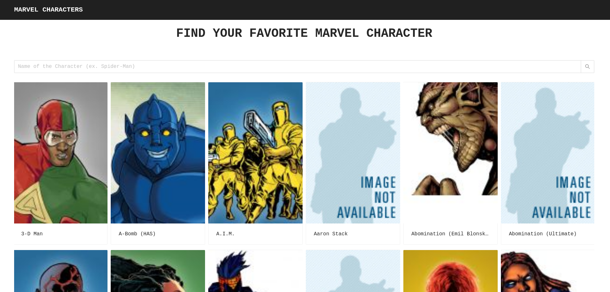

# Marvel Characters Search Engine

## Technologies Used:
* Framework: React
* Data Source: Marvel API
* UI Library: Ant Design
* Hosted continuous integration service: Travis CI
* Testing framework: Jest

## Decisions Made:
* Autocomplete: frequent change of components on the page when user types may be annoying for a user. I decided to use a minimalistic dropdown with suggested options.
* Storage of marvel API key pair in url: in order to not store it in source and given lack of serverside I require users to provide key pair and pass it around in url
* Avoid using react-router-dom: GitHub Pages doesn’t support routers that use the HTML5 pushState history API under the hood (for example, React Router using browserHistory) [Documentation](https://create-react-app.dev/docs/deployment/#notes-on-client-side-routing)

## Features Achieved:
* Mobile Friendly design(tested on Mobile Chrome/Firefox/Safari with screen sizes down to 4")
* Debounced autocomplete for suggesting characters
* Displaying multiple options of characters if name of the character is not unique

## How to start:
In addition to `localhost:3000`, you would need to add publicKey and and privateKey from the link.

The full path should look like that: `http://localhost:3000/?publicKey=<...>&privateKey=<...>`
Please, contact me if you don't have a link.